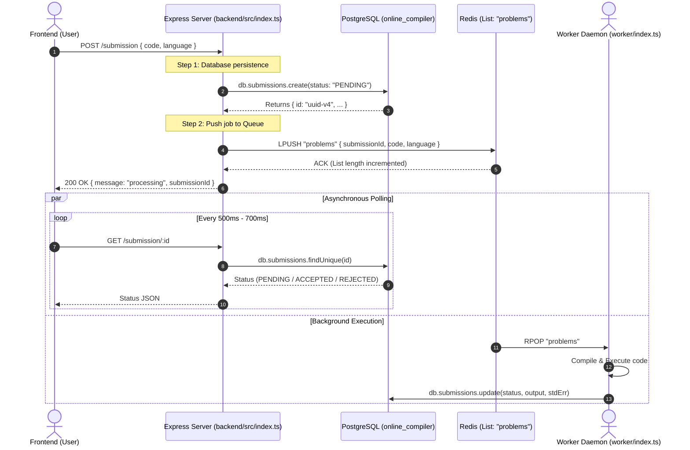

# Backend Service (`backend/`) — Architecture & Engineering Guide

Welcome to the backend engine of **Fiddle**. This service acts as the entry gateway for incoming user code submissions, orchestrating asynchronous job handling between **Express**, **PostgreSQL (via Prisma ORM)**, and an in-memory **Redis Queue**.

---

## 1. System Architecture & Information Flow



---

## 2. Deep Dive: Why We Don't Execute Code in the API Server

If the backend server ran user code directly inside its HTTP handlers, severe problems would arise:
1. **Thread/Event Loop Blocking**: Compiling C++ or executing infinite loops (e.g. `while(true) {}`) monopolizes system CPU and freezes the Node/Bun event loop. Other users cannot even connect or load the site.
2. **HTTP Request Timeouts**: Compilation and execution can take several seconds. Web clients or reverse proxies (Cloudflare, Nginx) timeout after 30–60 seconds.
3. **Security Vulnerability**: Untrusted user code executing in the same process space as your API server can read environment variables (`process.env.DATABASE_URL`), access files, or kill the web server.

### The Decoupled Solution:
- **Backend API**: Lean, stateless, fast. Accepts code, assigns a UUID, saves it to PostgreSQL as `PENDING`, pushes it to Redis in under **5 milliseconds**, and responds immediately.
- **Worker Daemon**: Isolated process that pulls jobs one by one, executes them safely, and writes results back to the database.

---

## 3. Everything About Redis: What It Is & How We Use It

### What is Redis?
**Redis (Remote Dictionary Server)** is an open-source, ultra-fast, in-memory key-value data structure store. Because all data resides in RAM rather than spinning disks, operations complete in sub-millisecond times (~0.1ms).

### Why Redis instead of a DB Table for Queuing?
While you *could* query PostgreSQL (`SELECT * FROM submissions WHERE status = 'PENDING' LIMIT 1`), polling a SQL database creates:
- High disk I/O and CPU overhead under load.
- Row-locking contention when multiple workers compete for jobs.
- Latency (milliseconds vs. microseconds).

Redis provides native **List data structures** that function as atomic FIFO (First-In, First-Out) message queues.

### Our Queue Implementation: `LPUSH` & `RPOP`
```text
           [Backend (Producer)]
                     │
                     ▼ LPUSH "problems" (Inserts at HEAD)
      ┌──────────────┬──────────────┬──────────────┐
 HEAD │ Submission 3 │ Submission 2 │ Submission 1 │ TAIL
      └──────────────┴──────────────┴──────────────┘
                                           │
                                           ▼ RPOP "problems" (Pulls from TAIL)
                                  [Worker (Consumer)]
```

#### In [src/index.ts](file:///d:/CPP/100xcode/web/redis/fiddle/backend/src/index.ts):
```typescript
import { createClient } from "redis";

// Connect to Redis on localhost:6379
const client = await createClient()
  .on("error", (err) => console.log("Redis Client Error", err))
  .connect();

// Inside POST /submission:
await client.lPush("problems", JSON.stringify({ 
  submissionId: response.id, 
  code, 
  language 
}));
```

- **`LPUSH problems <payload>`**: Inserts the new job at the head (left) of the list named `problems`.
- **`RPOP problems`** (in worker): Pops the oldest item from the tail (right) of the list.
- **Atomicity**: Even if 100 requests arrive at the exact same millisecond, Redis is single-threaded for command execution. Every `LPUSH` and `RPOP` is guaranteed to be race-condition free.

---

## 4. API Endpoints Reference

### 1. `POST /submission`
Submits code to be compiled and executed.
- **Request Body**:
  ```json
  {
    "code": "print('Hello world')",
    "language": "python"
  }
  ```
- **Response** (`200 OK`):
  ```json
  {
    "message": "processing",
    "submissionId": "f7d54e42-1e9a-4c28-9842-88d4076e01a8"
  }
  ```

### 2. `GET /submission/:submissionId`
Fetches the current execution status and output. Polled repeatedly by frontend until status is no longer `PENDING`.
- **Response** (`200 OK`):
  ```json
  {
    "id": "f7d54e42-1e9a-4c28-9842-88d4076e01a8",
    "code": "print('Hello world')",
    "language": "python",
    "status": "ACCEPTED",
    "output": "Hello world\n",
    "stdErr": null
  }
  ```

---

## 5. PostgreSQL & Prisma Database Layer

### Schema Definition ([prisma/schema.prisma](file:///d:/CPP/100xcode/web/redis/fiddle/backend/prisma/schema.prisma)):
```prisma
enum Status {
  PENDING
  ACCEPTED
  REJECTED
}

model Submissions {
  id        String   @id @default(uuid())
  code      String
  language  String
  status    Status   @default(PENDING)
  output    String?
  stdErr    String?
}
```

### PostgreSQL Adapter with Bun ([src/db.ts](file:///d:/CPP/100xcode/web/redis/fiddle/backend/src/db.ts)):
Prisma 6 & 7 use `@prisma/adapter-pg` to enable native database connection pooling with Bun:
```typescript
import { PrismaClient } from './generated/prisma/client';
import { PrismaPg } from '@prisma/adapter-pg';
import pg from 'pg';

const connectionString = process.env.DATABASE_URL!;
const pool = new pg.Pool({ connectionString });
const adapter = new PrismaPg(pool);

export const db = new PrismaClient({ adapter });
```

---

## 6. Key Learnings & Engineering Gotchas Solved

1. **Docker Port Mapping Confusion**:
   - Running `docker run postgres` defaults to internal port `5432`.
   - To connect from Windows (`localhost:5433`), host port forwarding `-p 5433:5432` is mandatory.
2. **Prisma 7 + Bun Environment Variable Injection**:
   - `prisma.config.ts` requires `DATABASE_URL` in its environment.
   - When using Bun, pass `--env-file=.env` explicitly:
     ```bash
     bun run --env-file=.env node_modules/prisma/build/index.js db push
     ```
3. **Decoupled Architecture with Redis**:
   - Moving long-running executions out of HTTP handlers guarantees 99.99% server responsiveness.

---

## 7. How to Run

```bash
# 1. Install dependencies
bun install

# 2. Push schema to Postgres
bun run prisma db push

# 3. Start development server with hot-reloading
bun dev
```
Server starts on: `http://localhost:3000`
